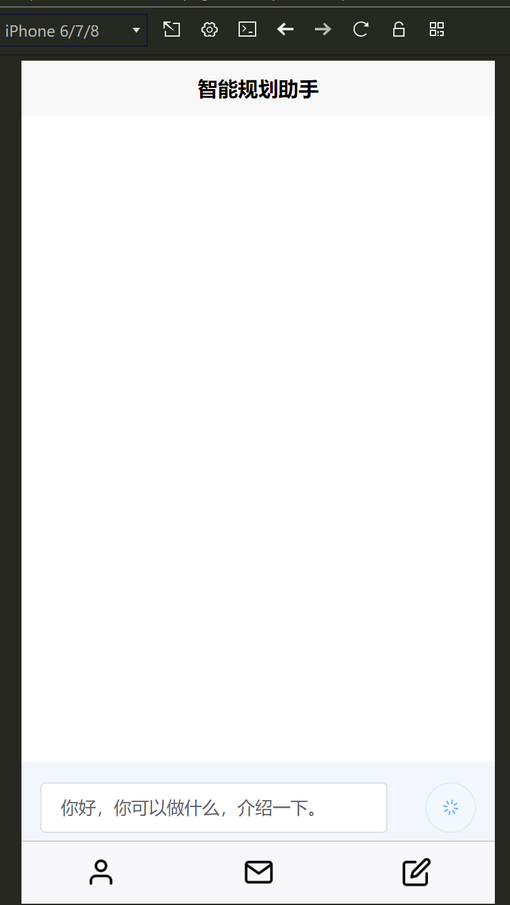

# 智能日程规划助手软件
> 本项目为技术栈目前主要为: Vue2， 
> 本项目为本人双创项目最佳实践。

## 页面介绍
### 首页 - index.vue
首页是一个应用合集的整理界面。

### 待办页面 - TodoApp.vue
待办具有TodoList的一般功能:
- 添加待办
- 删除待办
- 全选待办
- 清除全选

### 智能助手页 - AiHelper.vue
由于技术有限，智能助手本质上是一个聊天大模型。通过调用百度智能云后端接口实现。

